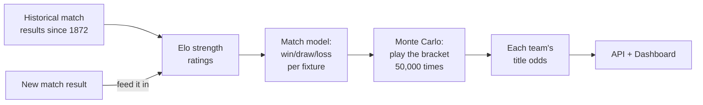

# Documentation — FIFA World Cup 2026 Forecast

Welcome. This folder is the **learning guide** for the project: it explains, from
scratch and without assuming any machine-learning background, what this app does, how it
works (including the actual maths, in plain English), how the code is laid out, how to run
it, and how to operate it live during the tournament.

> **One-paragraph summary.** This is a small, all-Python app that estimates each team's
> chance of winning the 2026 World Cup. It does **not** try to name a single winner.
> Instead it (1) rates every national team by strength, (2) turns each fixture into
> win/draw/loss probabilities, (3) plays out the entire remaining tournament tens of
> thousands of times on the computer, and (4) counts how often each team ends up as
> champion. After every real match finishes, you feed the result in and the numbers
> update. Success is judged by **calibration** — when the app says "20%", that thing
> should happen about 20% of the time — not by whether it called the winner.

## Who these docs are for

- **A developer new to the codebase** (including the project's own owner) who wants to
  understand how everything fits together.
- **A beginner in ML/stats** — every technical idea is explained in everyday language
  first, then with the formula the code actually uses.

## How this relates to the other docs

| Document | What it is | When to read it |
|----------|-----------|-----------------|
| **This folder (`docs/*.md`)** | A guide that *teaches* the built app. | You want to understand or run the project. |
| [`architecture-overview.md`](architecture-overview.md) | The original **design specification** — the "source of truth" for *why* each decision was made. | You want the rationale behind a design choice, or the full requirements. |
| [`../README.md`](../README.md) | The top-level project README — a concise, step-by-step build/run log. | You want the quick command cheat-sheet. |

These guide docs **complement** the architecture spec; they do not replace it. Where it
helps, each page links back to the relevant spec section (e.g. "§4.4").

## Recommended reading order

1. **[Getting Started](getting-started.md)** — install it and produce your first forecast.
2. **[Concepts Explained](concepts.md)** — the ideas (Elo, Poisson, Monte Carlo,
   calibration…) in plain English **plus** the maths.
3. **[How It Works](how-it-works.md)** — the end-to-end pipeline, with diagrams.
4. **[Data & Datasets](data.md)** — where the data comes from and how it is stored.
5. **[Code Reference](code-reference.md)** — a map of every module and script.
6. **[Operations](operations.md)** — running it live, the API/dashboard, and every config knob.
7. **[Testing](testing.md)** — how the automated tests work and what they protect.
8. **[Deployment](deployment.md)** — publishing these docs to GitHub Pages and deploying the dashboard.
9. **[Glossary & FAQ](glossary.md)** — quick definitions and common questions.

## The 30-second mental model

Read on in [Getting Started](getting-started.md).
