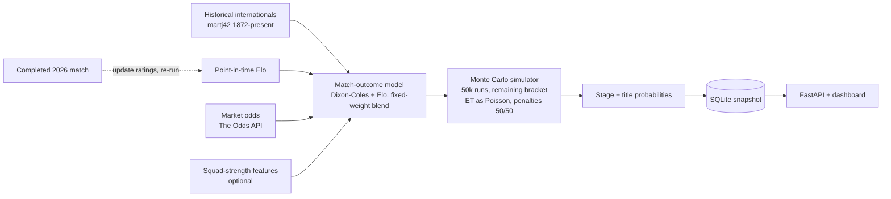
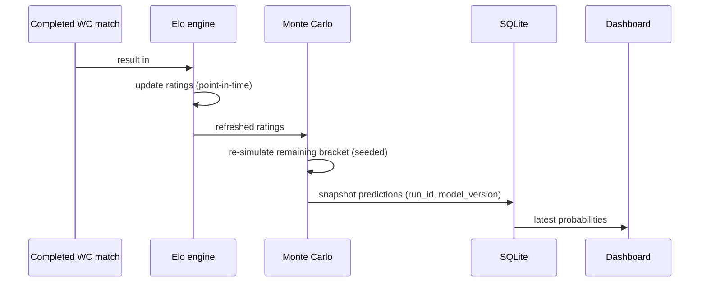

<!-- Generated by Cory · 2026-06-17 -->

# FIFA World Cup 2026 — Forecast App: Architecture Overview

*Generated by Cory · 17 June 2026*

This document defines the architecture for a live World Cup 2026 forecasting app. It is the build-ready successor to the original MVP blueprint, updated with four decisions resolved during review and corrected for the fact that the tournament is already under way.

-----

## Executive Summary

The app is a live title-odds tracker for the 2026 World Cup. It estimates, for every surviving team, the probability of reaching each knockout stage and of winning the tournament, then updates those numbers after each completed match. It is built entirely in Python and is designed for a short, high-value life: the group stage is in progress now, the Round of 32 begins **28 June 2026**, and the final is **19 July 2026** [5].

The forecast is produced indirectly. The app never names a champion. It predicts individual match outcomes, simulates the remaining bracket tens of thousands of times, and counts how often each team wins. This avoids the trap of “calling the winner,” which is unverifiable for a single tournament and dominated by luck — even a strong favorite peaks near 16–20%.

Success is measured by **calibration**, not by accuracy or by beating the betting market. The bar is honesty: when the app says 20%, that outcome should occur about 20% of the time. The market’s closing line is used as a reference ceiling and as a model input, not as an opponent to beat — a “beat the market” claim is unprovable on the roughly 32 knockout matches available and is explicitly out of scope.

### What a user actually gets

- **Live title odds** for every remaining team, ranked.
- **Each team’s path** — probability of reaching the Round of 16, quarters, semis, final, and of winning.
- **Live updates** — numbers move after every completed match, with the change shown.
- **Next-match predictions** — win / draw / loss and likely scorelines.
- **A reality check** — probabilities, not prophecy, with an option to show whether the app is more or less bullish than the market.
- **Shareable snapshots** — freeze and share a forecast, then review how it held up.

-----

## 1. Context & Drivers

### 1.1 Problem

Audiences want a credible, continuously updated read on where the tournament is heading. Existing public forecasts (FiveThirtyEight-style, Opta) prove the format works; this app delivers an independent, transparent, all-Python version with a full audit trail.

### 1.2 Timeline and value window

|Stage        |Dates [5]                        |
|-------------|---------------------------------|
|Group stage  |11 – 27 June 2026 *(in progress)*|
|Round of 32  |28 June – 3 July 2026            |
|Round of 16  |4 – 7 July 2026                  |
|Quarterfinals|9 – 11 July 2026                 |
|Semifinals   |14 – 15 July 2026                |
|Third place  |18 July 2026                     |
|Final        |19 July 2026                     |

The value window is **now → quarterfinals**, after which uncertainty resolves on its own. Because the group stage is live today, the simulator must condition on completed 2026 results from the very first build, not as a later feature.

### 1.3 Constraints

- All-Python stack, fewest moving parts.
- Roughly four-week useful life; no infrastructure justified beyond that.
- Single tournament only; no cross-cycle (“predict 2030”) forecasting.
- International football is data-starved (~10 competitive matches per team per year), which rules out data-hungry methods.

### 1.4 Stakeholders

Football-following consumers (primary), plus the developer/operator maintaining the update loop during the tournament.

-----

## 2. Locked Decisions

Each decision records why it was chosen over the alternative. Rows 1–5 carry over from the original blueprint; rows 6–8 were resolved during architecture review.

|#|Decision                    |Choice                                                       |Rationale                                                                                                                                                                                                                                                                                                                                                                                   |
|-|----------------------------|-------------------------------------------------------------|--------------------------------------------------------------------------------------------------------------------------------------------------------------------------------------------------------------------------------------------------------------------------------------------------------------------------------------------------------------------------------------------|
|1|Scope                       |This tournament only                                         |Four-year-out forecasts are near-worthless; infra cost is unjustified for a four-week artifact.                                                                                                                                                                                                                                                                                             |
|2|Success metric              |**Calibration** (RPS / Brier / log-loss)                     |“Did we name the winner” is unvalidatable (N=1) and luck-dominated. Calibration is measurable.                                                                                                                                                                                                                                                                                              |
|3|Stack                       |All Python                                                   |Fewest moving parts, fastest to live.                                                                                                                                                                                                                                                                                                                                                       |
|4|“Self-evolve”               |In-tournament updating only                                  |After each completed match: update ratings, re-simulate the remaining bracket. The bounded, honest version of the idea.                                                                                                                                                                                                                                                                     |
|5|Winner prediction           |Indirect, via simulation                                     |Predict per-match outcomes, Monte Carlo the bracket, count title frequencies. Never predict the champion directly.                                                                                                                                                                                                                                                                          |
|6|**Market odds role**        |**Feature + reference ceiling, not a “beat” target**         |Sharp closing lines are well-calibrated but not perfectly efficient [7]; beating them is unprovable on ~32 matches. Using odds as the strongest free input sharpens the live forecast. You cannot beat a number you copied in, so the product goal is to *match* the market’s calibration, and a parallel odds-free model serves as the honest “do our fundamentals add signal?” diagnostic.|
|7|**Knockout draw resolution**|**Extra time as additional Poisson minutes; penalties 50/50**|Tied knockouts go to 30 minutes of extra time, then a shootout [8]. Evidence shows the favorite’s edge survives in extra time but shootouts are essentially random [6]. Continuing the same goal process for 30 minutes reuses existing machinery and preserves the favorite’s edge automatically; a 50/50 shootout avoids faking precision.                                                |
|8|**Blend method**            |**Fixed-weight average, not learned stacking**               |With ~10 matches/team/year, learned stack weights are noisy and overfit. A configurable fixed weight is more robust and defensible for an MVP.                                                                                                                                                                                                                                              |

-----

## 3. Solution Overview

### 3.1 Architectural style

A linear data pipeline feeding a Monte Carlo simulator, wrapped in an update loop. Each component is a Python module with a clear input and output contract. State lives in SQLite.

### 3.2 Data flow



### 3.3 Update loop



-----

## 4. Component Details

### 4.1 Data & store

**Responsibility:** load historical and live match data; persist teams, matches, ratings history, and prediction snapshots.
**Technology & rationale:** `pandas` for transforms; `SQLite` for storage. Postgres is rejected (overkill for ~50k rows over four weeks); CSV-only is rejected (loses the prediction-snapshot history needed for the share/collate requirement).
**Risk:** input drift as upstream sources update — mitigated by snapshotting each run’s inputs (see §7).

### 4.2 Ratings — Elo

**Responsibility:** maintain one strength rating per team, updated after every match.
**Technology & rationale:** a custom Elo engine (~100 lines), configurable K-factor and home advantage. The FIFA ranking is a weaker predictor and is used only as a feature; Glicko/TrueSkill add moving parts for marginal MVP gain.
**Critical constraint — no leakage:** the rating applied to match *i* must be computed only from matches before match *i* (Elo-before). Backtesting must reconstruct point-in-time ratings; it must never apply today’s published ratings retroactively. Choose the self-computed Elo as the single backbone to avoid double-counting a scraped Elo that encodes the same signal.

### 4.3 Match-outcome model

**Responsibility:** produce, for any fixture, a win/draw/loss probability and a full scoreline distribution.
**Technology & rationale:** **Dixon-Coles / bivariate Poisson** (`scipy` / `statsmodels`) for scoreline granularity, blended by **fixed weight** with the Elo-implied outcome. Deep learning and sequence models are rejected (data-starved). LightGBM on engineered features is optional and last in line; it is also overfit-prone on small samples, so it is not part of the core.
**Adaptation required:** Dixon-Coles was designed for league football with home/away structure. Most 2026 matches are at neutral venues, with genuine home advantage only for the USA, Canada, and Mexico. The home/away parameterization and the low-score correction must be re-fit and validated for international, neutral-venue play rather than dropped in unchanged.

### 4.4 Simulator

**Responsibility:** play the remaining bracket 50,000 times, conditioned on completed 2026 results, and report stage and title probabilities.
**Technology & rationale:** `NumPy` Monte Carlo, **seeded** for reproducibility. Closed-form propagation is rejected (intractable with tiebreakers); fewer than 10k sims give noisy tail and title probabilities.
**Knockout resolution:** when a simulated match is level at 90 minutes, play 30 further minutes of the same Poisson goal process at the proportional rate; if still level, decide the winner 50/50 [6][8].
**Highest bug-risk component — the Round of 32 assignment:** with 12 groups, the eight best third-placed teams fill bracket slots according to FIFA’s published lookup (Annex C, 495 possible combinations [5]). A bug here silently corrupts every downstream title probability with no visible error. This logic must be unit-tested against FIFA’s actual combination table before any output is trusted.

### 4.5 Calibration harness

**Responsibility:** measure forecast honesty and guard against leakage.
**Technology & rationale:** RPS (the standard for ordered three-outcome football), Brier, log-loss, and a reliability plot. Backtest the match model on historical internationals with a strict time-split. Accuracy / winner-call is rejected as a metric — unvalidatable and mechanically inflated as the tournament narrows.
**Market as reference:** compare the model’s calibration to the de-vigged odds-implied probabilities. Markets tend to be at least as well calibrated as a simple model [7], so matching them is the realistic target. Run a parallel **odds-free** model to isolate whether the fundamentals add signal beyond the price.

### 4.6 Serving & UI

**Responsibility:** expose the latest forecast and let users explore it.
**Technology & rationale:** `FastAPI` for endpoints plus a **Streamlit or Dash** dashboard. *Accepted tension:* pure-Python dashboards deliver clean and interactive, not “astonishing animated.” True animation is the one place a thin JS layer would earn its keep, but it conflicts with the all-Python constraint and the shelf life, so it stays a Could-have, last in line.

-----

## 5. Data Model

SQLite schema; satisfies “save per match, collate, share.”

- **teams** — `id`, `name`, `confederation`, `current_elo`
- **matches** — `id`, `date`, `stage`, `home`, `away`, `result`, `feature_snapshot (JSON)`
- **ratings_history** — `team_id`, `match_id`, `elo_before`, `elo_after`, `timestamp`
- **predictions** — `run_id`, `model_version`, `timestamp`, `team_id`, `stage_probabilities`, `title_prob`

One row group per simulation run gives a full audit trail and a shareable export. Storing `elo_before` explicitly is what makes leak-free backtesting auditable.

-----

## 6. Data Sources

Free-first. Each source lists what it provides and how it is used.

|Source                                                   |Provides                   |Use                                                         |Cost         |
|---------------------------------------------------------|---------------------------|------------------------------------------------------------|-------------|
|martj42 “International results 1872–present” (GitHub) [1]|~48k match results         |Train + backtest the match model                            |Free         |
|eloratings.net (World Football Elo) [2]                  |Elo ratings / history      |Feature and sanity check (self-computed Elo is the backbone)|Free         |
|The Odds API [3]                                         |Match odds                 |Model **feature** and calibration **reference**             |Free tier    |
|Transfermarkt / EA FC ratings [4]                        |Squad value, player ratings|Squad-strength features (optional)                          |Free / scrape|
|FIFA 2026 fixtures + live results [5]                    |Completed-match results    |Condition the simulator; drive the update loop              |Free         |

Deliberately skipped for MVP: StatsBomb event-level xG (thin international coverage, high effort, low marginal payoff).

-----

## 7. Cross-Cutting Concerns

**Leakage control.** Every backtest uses point-in-time Elo (§4.2). The time-split is enforced at the data layer, not left to model code.

**Reproducibility.** The Monte Carlo RNG is seeded, and each run snapshots its inputs (ratings, odds, completed results). Re-running on the same state must yield identical numbers — this is what makes the audit trail and the “pre-tourney vs now” comparison meaningful rather than noise.

**Bracket correctness.** The Round of 32 third-placed-team assignment is unit-tested against FIFA’s published combinations (§4.4). This is treated as a correctness gate, not a nice-to-have.

**Calibration honesty.** The product claims to be well-calibrated, not market-beating. The harness enforces that claim and flags regressions.

**Compliance.** Transfermarkt scraping carries terms-of-service exposure; squad-strength features are cached and optional so the core app never depends on scraped data. The app presents probabilities for entertainment and information; it is not a betting product and gives no betting advice.

**Performance.** 50k sims over the remaining bracket runs in seconds on a laptop; no scaling work is warranted for a four-week artifact.

-----

## 8. Build Sequence (MoSCoW, keyed to 28 June)

1. **Spine (ship first) — Must.** Data load + Elo baseline + simulator on the current live bracket, conditioned on completed group results → first title/stage probabilities. *This alone is a working forecast.*
1. **Scoreline + blend — Must.** Add Dixon-Coles, blend with Elo by fixed weight, wire into the simulator (extra-time as Poisson minutes).
1. **Calibration harness — Should.** RPS / Brier / log-loss, reliability plot, time-split backtest, market reference, odds-free diagnostic.
1. **Update loop + snapshots — Should.** Re-simulate after each completed match; write prediction snapshots to the DB.
1. **Dashboard — Should.** FastAPI + Streamlit/Dash; live odds, per-team path, pre-tourney vs now, market comparison, shareable export.
1. **Features polish — Could.** Odds and squad-strength features, ensemble tuning, optional LightGBM view.

This front-loads a usable forecast and pushes the website last, matching the value window.

-----

## 9. Risks & Mitigations

|Risk                                     |Impact                                         |Mitigation                                                                             |
|-----------------------------------------|-----------------------------------------------|---------------------------------------------------------------------------------------|
|R32 third-place assignment bug           |Silent corruption of all title probabilities   |Unit-test against FIFA’s 495-combination table; correctness gate before launch         |
|Backtest leakage via Elo                 |Overstated, untrustworthy accuracy             |Point-in-time Elo enforced at data layer; store `elo_before`                           |
|Calibration unprovable in time           |The headline claim cannot be demonstrated      |Reframe to “match the market”; report reliability as it converges, not a single verdict|
|Dixon-Coles mis-applied to neutral venues|Biased scorelines                              |Re-fit and validate for international play; explicit host advantage                    |
|Overfitting (stacking, LightGBM)         |Noise sold as signal                           |Fixed-weight blend; LightGBM optional and last                                         |
|Scraping ToS exposure                    |Operational / legal risk                       |Squad-strength optional and cached; core never depends on it                           |
|Non-reproducible runs                    |Audit trail and “now vs pre” become meaningless|Seed RNG; snapshot inputs per run                                                      |

-----

## 10. Out of Scope (Won’t)

Deep learning · event-level xG models · real-time in-match win-probability · cross-cycle / 2030 forecasting · any “beat the market” or “high-accuracy winner calling” claim · live animated UI.

-----

# Appendix

## Appendix A — Glossary

- **Elo** — a rating that rises and falls based on results versus opponent strength; the app’s team-strength backbone.
- **Point-in-time rating** — a rating computed using only information available before a given match, required to prevent leakage.
- **Dixon-Coles model** — a Poisson-based goal model with a correction for low-scoring matches, used here for scoreline distributions.
- **Bivariate Poisson** — a model of two correlated goal counts (home and away).
- **Monte Carlo simulation** — running the tournament many times with random draws to estimate how often each outcome occurs.
- **Conditioning** — fixing already-played results and simulating only the remainder.
- **RPS (Ranked Probability Score)** — the standard scoring rule for ordered three-outcome (win/draw/loss) football forecasts; lower is better.
- **Brier score / log-loss** — alternative scoring rules for probabilistic forecasts; lower is better.
- **Calibration** — the property that stated probabilities match observed frequencies (20% events happen ~20% of the time).
- **Reliability diagram** — a plot of predicted probability against observed frequency, used to read calibration.
- **Closing line** — the final betting odds before kickoff; treated here as a well-informed reference, not a target to beat.
- **De-vig** — removing the bookmaker margin from odds to recover an implied probability.
- **MoSCoW** — a prioritization scheme: Must, Should, Could, Won’t.

## Appendix B — Abbreviations

- **WC** — World Cup
- **R32 / R16** — Round of 32 / Round of 16
- **QF / SF** — Quarterfinals / Semifinals
- **ET** — Extra time
- **xG** — Expected goals
- **RNG** — Random number generator
- **API** — Application programming interface
- **ToS** — Terms of service

## Appendix C — References

Access date for all sources: 17 June 2026.

1. martj42, *International football results 1872–present*, GitHub. <https://github.com/martj42/international_results>
1. *World Football Elo Ratings*. <https://www.eloratings.net>
1. *The Odds API*. <https://the-odds-api.com>
1. *Transfermarkt*. <https://www.transfermarkt.com>
1. FIFA, *FIFA World Cup 2026 knockout stage match schedule and bracket*. <https://www.fifa.com/en/tournaments/mens/worldcup/canadamexicousa2026>
1. FiveThirtyEight, *Extra Time Isn’t a Crapshoot in the Knockout Round, But Penalties Are*. <https://fivethirtyeight.com/features/extra-time-isnt-a-crapshoot-in-the-knockout-round-but-penalties-are>
1. S. Wilkens (2026), *Can simple models predict football — and beat the odds? Lessons from the German Bundesliga* — bookmaker odds are well calibrated but not fully efficient. <https://journals.sagepub.com/doi/10.1177/22150218261416681>
1. ESPN, *How do extra time and penalty shootouts work at the World Cup?* <https://www.espn.com/soccer/story/_/id/48827479/how-do-extra-penalty-shootouts-work-world-cup>

-----

# Build Prompts for Claude

These prompts build the app step by step, matching the build sequence in §8. Use them in order, ideally with Claude Code so each step lands as working files and tests. Paste this architecture document in once at the start as shared context, then run one prompt per step. Each prompt names its deliverable and an acceptance check so you can confirm the step is done before moving on.

### Step 0 — Set the context

```text
You are helping me build a live FIFA World Cup 2026 forecasting app in Python.
I've attached the architecture document; treat it as the source of truth.

We will build it in steps. For each step: write the code as real files, add unit
tests where the architecture calls for them, keep everything all-Python, and stop
at the stated acceptance check so I can verify before we continue.

Confirm you've read the architecture and list the components in build order. Don't
write code yet.
```

### Step 1 — Project scaffold and data layer

```text
Step 1: scaffold the project and build the data layer.

- Set up a Python project (venv, requirements.txt) with: pandas, numpy, scipy,
  statsmodels, fastapi, uvicorn, requests, plus streamlit OR dash.
- Create the SQLite schema exactly as in §5: teams, matches, ratings_history,
  predictions. Use stdlib sqlite3 or SQLAlchemy.
- Write a loader that pulls the martj42 international results CSV [ref 1] and
  populates teams and matches. Make the load idempotent (re-running doesn't
  duplicate rows).

Acceptance: the schema is created, the loader runs twice without duplicating data,
and you print row counts for teams and matches.
```

### Step 2 — Elo engine (point-in-time)

```text
Step 2: build the Elo rating engine.

- Implement a custom Elo engine (~100 lines): configurable K-factor and home
  advantage, optional margin-of-victory multiplier.
- Replay all historical matches in date order to produce point-in-time ratings.
  For each match, store elo_before for both teams in ratings_history, then update.

CRITICAL: the rating used for match i must depend only on matches strictly before
match i. No future information. This is the leakage guard from §4.2.

Acceptance: deterministic output; a unit test on a small hand-checked sequence;
and a sanity print of current top-20 ratings that looks plausible.
```

### Step 3 — Monte Carlo simulator (the spine)

```text
Step 3: build the Monte Carlo bracket simulator. This is the spine — after this
step we have a working forecast.

- Encode the 2026 format: 12 groups of 4; top two per group plus the eight best
  third-placed teams advance to the Round of 32; then R32 -> R16 -> QF -> SF ->
  final, using FIFA's two-pathway seeding.
- Implement the R32 third-placed-team assignment using FIFA's published lookup
  (Annex C, 495 combinations). This is the highest bug-risk piece in the whole app.
- Resolve each simulated match for now using the Elo-implied win/draw/loss. For a
  knockout draw: play 30 extra minutes of the same goal process at the proportional
  rate; if still level, decide 50/50.
- Condition on completed 2026 results (the group stage is already in progress).
- Run 50,000 sims with a SEEDED RNG. Output stage and title probabilities per team.

CRITICAL: unit-test the third-placed assignment against FIFA's actual combination
table before trusting any output.

Acceptance: probabilities are internally consistent (each stage's advancing count
matches the format), the favorite lands ~16-20%, and two runs with the same seed
produce identical numbers.
```

### Step 4 — Scoreline model and blend

```text
Step 4: add the scoreline model and blend it with Elo.

- Implement a Dixon-Coles / bivariate Poisson model (scipy/statsmodels) that
  outputs win/draw/loss probabilities and a scoreline distribution.
- Adapt it for international, neutral-venue play: home advantage only for USA,
  Canada, Mexico; re-fit (don't drop in unchanged) the low-score correction.
- Blend with the Elo-implied outcome using a FIXED, configurable weight — not
  learned stacking (data is too thin, per §4.3).
- Wire the blended model into the simulator, replacing Elo-only resolution. Extra
  time continues the Poisson process; penalties stay 50/50.

Acceptance: backtest draw rate is close to the historical international rate, and
the simulator still reproduces under a fixed seed.
```

### Step 5 — Calibration harness

```text
Step 5: build the calibration / evaluation harness.

- Implement RPS (primary), Brier, and log-loss, plus a reliability diagram.
- Backtest the match model on historical internationals with a strict time-split,
  using point-in-time Elo (no leakage).
- Add the market as a reference: de-vig The Odds API prices [ref 3] and compare the
  model's calibration to the market's. Frame the goal as matching the market, not
  beating it.
- Build a parallel ODDS-FREE model variant to test whether the fundamentals add
  signal beyond the price.

Acceptance: metrics print for model, market, and odds-free variant; the reliability
plot is saved; and a short report summarizes how the model's calibration compares
to the market.
```

### Step 6 — Update loop and snapshots

```text
Step 6: build the in-tournament update loop.

- On each newly completed WC match: ingest the result, update Elo, re-simulate the
  remaining bracket, and write one prediction snapshot (run_id, model_version,
  timestamp) to the predictions table.
- Make it idempotent and seeded so re-running on the same state is identical.

Acceptance: feeding a new result moves the numbers sensibly (a winner's title prob
rises, a loser's drops toward zero), snapshots are queryable as a history, and
re-running the same state reproduces the same snapshot.
```

### Step 7 — API and dashboard

```text
Step 7: build the serving layer and dashboard.

- FastAPI endpoints: latest probabilities, a single team's stage path, and the
  snapshot history.
- A Streamlit (preferred for speed) or Dash dashboard showing: ranked live title
  odds, per-team path to the final, a pre-tournament vs now toggle, a last-updated
  timestamp, and a comparison against the market.
- A shareable snapshot export.

Keep it clean and interactive; no animation (per §4.6).

Acceptance: the dashboard loads, shows live numbers from the DB, and reflects new
results after the update loop runs.
```

### Step 8 — Features polish (optional, Could-have)

```text
Step 8 (optional): polish features if time remains before the quarterfinals.

- Add market odds as a model FEATURE (de-vigged) — as an input only, never as a
  "beat the market" target.
- Add optional squad-strength features from Transfermarkt / ratings [ref 4],
  cached and ToS-respecting, so the core never depends on scraped data.
- Optionally add a LightGBM view to the blend. Re-fit the fixed blend weight and
  re-run the calibration harness to confirm no regression versus Step 5.

Acceptance: calibration metrics do not regress against the Step 5 baseline.
```