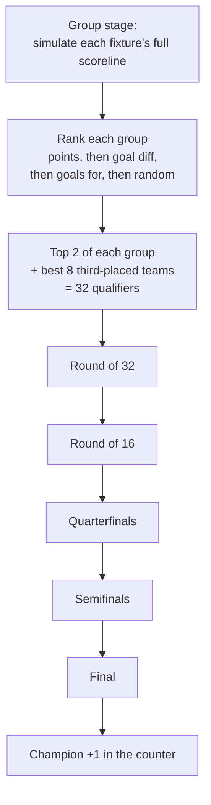

# Concepts Explained (plain English + the maths)

This is the heart of the documentation. Every idea is explained twice: first in everyday
language, then with the **actual formula the code uses**, with every symbol defined and a
small worked example. You do **not** need a maths or ML background — read the plain-English
part and skip the formula boxes if you like.

← Back to the [documentation index](README.md). For the design rationale, see the
[architecture spec](architecture-overview.md).

**Contents**

1. [What "forecasting" means here (and what it doesn't)](#1-what-forecasting-means-here)
2. [Rating team strength — Elo](#2-rating-team-strength-elo)
3. [Turning strength into a match forecast — Poisson & Dixon-Coles](#3-turning-strength-into-a-match-forecast-poisson-and-dixon-coles)
4. [A second opinion — the Elo-implied outcome](#4-a-second-opinion-the-elo-implied-outcome)
5. [Combining opinions — the fixed-weight blend](#5-combining-opinions-the-fixed-weight-blend)
6. [Playing the tournament 50,000 times — Monte Carlo](#6-playing-the-tournament-50000-times-monte-carlo)
7. [An optional third opinion — LightGBM](#7-an-optional-third-opinion-lightgbm)
8. [Judging the forecast — calibration & scoring rules](#8-judging-the-forecast-calibration-and-scoring-rules)
9. [The betting market as a yardstick — odds & de-vigging](#9-the-betting-market-as-a-yardstick-odds-and-de-vigging)
10. [Two ideas that keep it honest — leakage & reproducibility](#10-two-ideas-that-keep-it-honest)

---

## 1. What "forecasting" means here

**Plain English.** The app never says "Brazil will win." It says things like "Brazil has a
14% chance of winning, France 11%, …". A probability is a statement about *uncertainty*. We
can't grade a single probability as right or wrong — Brazil winning doesn't prove "14%" was
correct. So how do we know if the app is any good?

The answer is **calibration**: gather *all* the times the app said "about 20%" and check
that those things happened about 20% of the time. A well-calibrated forecaster's 70%
predictions come true ~70% of the time, their 30% predictions ~30% of the time, and so on.
This — not "did it name the champion" — is the project's definition of success (architecture
[decision #2](architecture-overview.md#2-locked-decisions)).

We measure calibration with **scoring rules** ([section 8](#8-judging-the-forecast-calibration-and-scoring-rules)).

---

## 2. Rating team strength (Elo)

**Plain English.** Before forecasting a match we need a single number for each team's
strength. The app uses **Elo ratings** — the same idea used in chess. Everyone starts at
**1500**. After each match the winner takes points from the loser; beating a much stronger
team earns more points than beating a weaker one, and winning by a big margin earns a bit
more than a narrow win. Playing through every international match since 1872 in date order
leaves each team with a rating that reflects its whole history.

**Where in the code.** The pure maths is in [`elo.py`](../src/forecast/elo.py); replaying it
over history (in the leak-free order) is in [`ratings.py`](../src/forecast/ratings.py).
Spec: [§4.2](architecture-overview.md#4-component-details).

> **The maths.**
>
> **Expected result.** Before a match, the home team's *expected score* `We` (a number
> between 0 and 1 — think "expected share of the points") is:
>
> ```
> We = 1 / ( 10^(-dr/400) + 1 )
> where  dr = (R_home + H) − R_away      (H = home advantage, 0 at a neutral venue)
> ```
>
> - `R_home`, `R_away` — the two teams' current ratings.
> - `H` — the home-advantage bonus, **100** rating points (`ELO_HOME_ADVANTAGE`), added only
>   when the game is **not** at a neutral venue.
> - The `400` is the standard Elo scale: a 400-point lead means roughly a 10-to-1 expectation.
>
> **The update.** After the match:
>
> ```
> R_new = R_old + K · G · (W − We)
> ```
>
> - `W` — the **actual** result for that team: `1` win, `0.5` draw, `0` loss.
> - `K` — the step size, **40** (`ELO_K`). Bigger `K` = ratings react faster.
> - `G` — the **margin-of-victory** multiplier: `1` for a draw or 1-goal win, `1.5` for a
>   2-goal win, and `(11 + |goal difference|) / 8` for 3+ goals (`ELO_USE_MOV = True`).
> - `(W − We)` is the *surprise*: you gain points only by doing better than expected.
>
> **Worked example.** Two equal teams (both 1500), home side wins 1–0 at a non-neutral venue.
> `dr = (1500 + 100) − 1500 = 100`. `We = 1/(10^(−100/400)+1) = 1/(0.562+1) = 0.640`.
> The home team won, so `W = 1`, and a 1-goal win gives `G = 1`. New rating:
> `1500 + 40·1·(1 − 0.640) = 1500 + 14.40 = 1514.40`. (This exact number is checked in
> `tests/test_elo.py`.) The away team loses the mirror amount.

The default knobs (`ELO_DEFAULT_RATING`, `ELO_K`, `ELO_HOME_ADVANTAGE`, `ELO_USE_MOV`) live
in [`config.py`](../src/forecast/config.py).

---

## 3. Turning strength into a match forecast (Poisson and Dixon-Coles)

Now we need to convert "Team A is 1700, Team B is 1500" into win/draw/loss probabilities —
and, for the group stage, plausible **scorelines** (1–0, 2–2, …).

### 3a. Goals as a Poisson process

**Plain English.** Goals in football arrive somewhat randomly and independently throughout a
match. The natural model for "count of rare-ish events in a fixed time" is the **Poisson
distribution**. If a team is *expected* to score, say, 1.5 goals, the Poisson distribution
tells us the chance it actually scores 0, 1, 2, 3, … goals. We just need each team's
**expected goals** (called `λ`, "lambda").

> **The maths.** The probability a team with expected goals `λ` scores exactly `k` goals is
> the Poisson formula:
>
> ```
> P(k) = e^(−λ) · λ^k / k!
> ```
>
> The app gets each side's `λ` from the Elo gap (the published "FIFA-tournament" form of
> Gilch & Müller 2018), in [`match_model.team_lambdas`](../src/forecast/match_model.py):
>
> ```
> λ_home = exp( β₀ + 0.5·β₁·EloDiff + host_term )
> λ_away = exp( β₀ − 0.5·β₁·EloDiff )
> where EloDiff = R_home − R_away
> ```
>
> - `β₀` ("beta-zero") sets the **baseline** goals. The seed is `ln(BASE_GOALS/2) = ln(1.3)`,
>   so an even, neutral match expects `BASE_GOALS = 2.6` total goals (1.3 each).
> - `β₁` scales **how much an Elo edge becomes a scoring edge** (`ELO_GOAL_SCALE_LOG`, seed
>   `0.0017`). The `±0.5` split keeps the total fair regardless of who is "home".
> - `host_term` — a small bonus added to the home `λ` **only for host nations** (USA, Canada,
>   Mexico) at non-neutral games (`HOST_HOME_GOALS_LOG`, seed `0.20`).
>
> **Worked example.** EloDiff = 200, even venue. `λ_home = exp(0.262 + 0.5·0.0017·200) =
> exp(0.262 + 0.17) = 1.54`; `λ_away = exp(0.262 − 0.17) = 1.10`. The stronger side is
> expected to score ~1.5, the weaker ~1.1. Feed those into the Poisson formula and you get a
> full grid of scoreline probabilities.

These are *seed* values; the real ones are **fitted from history** (see
[fitting](#fitting-the-model-from-history) below).

### 3b. The Dixon-Coles fix for low scores

**Plain English.** Plain independent Poisson has a known flaw: it slightly **under-predicts
draws**, especially 0–0 and 1–1. Real football has more of those than pure chance would
suggest (teams play cautiously at 0–0). Dixon & Coles (1997) patched this by nudging the
four lowest scorelines up or down by a single correction parameter, **ρ** ("rho").

**Where in the code.** [`dixon_coles.py`](../src/forecast/dixon_coles.py). Spec:
[§4.3](architecture-overview.md#43-match-outcome-model).

> **The maths.** Multiply the probabilities of the four lowest scorelines by a factor `τ`
> ("tau"):
>
> ```
> τ(0,0) = 1 − λ·μ·ρ        τ(0,1) = 1 + λ·ρ
> τ(1,0) = 1 + μ·ρ          τ(1,1) = 1 − ρ        (τ = 1 for every other score)
> ```
>
> - `λ`, `μ` — home and away expected goals.
> - `ρ` — the correction. With **ρ < 0** the model moves probability *onto* 0–0 and 1–1
>   (more draws), matching reality. The seed is `DC_RHO = −0.05`; the real value is re-fit for
>   international football by `fit_rho` (Dixon & Coles' original league value isn't reused).
>
> After applying `τ`, the grid is renormalised so all scoreline probabilities sum to 1. Sum
> the grid cells where home > away / equal / home < away to get `(p_home, p_draw, p_away)`.

This grid is the **"Dixon-Coles view"** of the match — one of the opinions we'll blend.

---

## 4. A second opinion: the Elo-implied outcome

**Plain English.** Instead of going via goals, we can read win/draw/loss probabilities
*straight off the Elo gap*. The expected score `We` from [section 2](#2-rating-team-strength-elo)
already tells us roughly how the points should split; we just decide how much of that is
"draw" versus a clean win. Closer-rated teams draw more often, so the draw chance shrinks as
the Elo gap grows.

**Where in the code.** [`match_model.elo_outcome`](../src/forecast/match_model.py).

> **The maths.**
>
> ```
> We     = 1 / (10^(−Δ/400) + 1)            (Δ = EloDiff, plus host boost if applicable)
> p_draw = draw_base · exp(−|Δ| / draw_decay)
> p_home = We − p_draw/2
> p_away = 1 − We − p_draw/2                 (then clip ≥ 0 and renormalise)
> ```
>
> - `draw_base` — the draw chance for a perfectly even match (`DRAW_BASE`, seed `0.27`).
> - `draw_decay` — how fast draws fade as the gap widens (`DRAW_DECAY`, seed `350` Elo points).
>
> The identity `p_home + p_draw/2 = We` keeps this consistent with the Elo expected score.

This is the **"Elo view"** of the match — our second opinion.

---

## 5. Combining opinions: the fixed-weight blend

**Plain English.** We now have two forecasts for the same match: the Dixon-Coles (goals) view
and the Elo view. Rather than trust either alone, we take a **weighted average** of them. The
weight is **fixed** — currently 60% Dixon-Coles, 40% Elo — not learned per-match.

**Why fixed and not "learned"?** A fancier method ("stacking") would try to *learn* the best
weights from data. But international teams play only ~10 matches a year, so there isn't enough
data to learn weights reliably — a learned blend would **overfit** (memorise noise). A single
fixed weight, chosen once by a careful search, is more robust. This is architecture
[decision #8](architecture-overview.md#2-locked-decisions).

**Where in the code.** [`match_model.blend`](../src/forecast/match_model.py) (two views) and
`blend_n` (the general N-view version).

> **The maths.** For weight `w` on the Dixon-Coles view:
>
> ```
> p_final = w · p_dixoncoles + (1 − w) · p_elo        (applied to each of home/draw/away)
> ```
>
> `w = BLEND_WEIGHT = 0.6`. The value isn't arbitrary: `scripts/tune_blend_weight.py`
> grid-searches it on a held-out test set and `0.6` scored slightly better than the original
> `0.5` (RPS `0.16992` vs `0.16997` — lower is better; see [section 8](#8-judging-the-forecast-calibration-and-scoring-rules)).

### Fitting the model from history

The seed numbers above are just starting points. [`fit_match_model`](../src/forecast/match_model.py)
re-estimates the real `β₀`, `β₁`, host term, `ρ`, and the draw curve from decades of actual
results, using a **Poisson regression** (`statsmodels` GLM). Two important details:

- **Recent matches count more.** Each historical match is weighted by an exponential
  **time-decay** with a half-life of ~8 years (`DC_FIT_HALF_LIFE_DAYS`), so 2024 form matters
  more than 1994 form.
- **It's leak-free.** The fit uses each match's *pre-match* Elo (see
  [section 10](#10-two-ideas-that-keep-it-honest)), so the model is never told the future.

---

## 6. Playing the tournament 50,000 times (Monte Carlo)

**Plain English.** A match model gives one fixture's odds. But "who wins the World Cup"
depends on dozens of future matches, who finishes where in each group, who they then meet in
the knockouts, and so on — far too tangled to compute by hand. So we **simulate**: let the
computer play the *entire* remaining tournament start-to-finish, using the match model to
decide each game with a dice roll. Do that **50,000 times** and simply count: if Brazil wins
the title in 7,000 of the 50,000 simulated tournaments, its title probability is
7000/50000 = **14%**. This "play it many times and count" technique is called **Monte Carlo**.

**Where in the code.** [`simulator.py`](../src/forecast/simulator.py) — "the spine" of the
app. Spec: [§4.4](architecture-overview.md#44-simulator).

How one simulated tournament plays out:



Key details, all faithful to FIFA's real rules:

- **Group games need scorelines, not just winners**, because group ranking uses points →
  goal difference → goals scored → (last resort) a random draw. So group fixtures sample a
  full scoreline: the *winner* comes from the blended model, the *exact score* from the
  Dixon-Coles grid.
- **Knockout games only need a winner.** The blend gives win/draw/loss for 90 minutes. A draw
  goes to **extra time**, modelled as 30 more minutes of the same Poisson goal process at
  one-third the rate (`λ/3`). Still level → a coin-flip **penalty shootout** (50/50). This is
  architecture [decision #7](architecture-overview.md#2-locked-decisions).
- **The "best 8 third-placed teams" puzzle.** 32 of 48 teams advance: 12 group winners, 12
  runners-up, and the 8 best third-placed teams. *Which* third-placed team goes into *which*
  bracket slot follows a fixed 495-row lookup table FIFA published (Annex C). The app loads
  this table **as data** rather than guessing — it's the single highest-risk piece, so it's
  guarded by a dedicated test (see [Testing](testing.md)).

The simulator's output is, per team, the probability of *reaching* each stage
(`r32, r16, qf, sf, final, title`).

---

## 7. An optional third opinion: LightGBM

**Plain English.** [`gbm_view.py`](../src/forecast/gbm_view.py) adds an *optional* third
forecaster: a **gradient-boosted decision tree** model (LightGBM) — a general-purpose machine
learning method — trained to predict win/draw/loss from the Elo gap and home flag. If
LightGBM is installed and there's enough data, it joins the blend as a third view (weights
`0.6 / 0.2 / 0.2` for Dixon-Coles / Elo / LightGBM). If it's **not** installed, the app
silently falls back to the two-view blend — **the core never depends on it**. It's a
"could-have" polish item, kept isolated because tree models overfit easily on small samples.

---

## 8. Judging the forecast: calibration and scoring rules

**Plain English.** To grade probabilistic forecasts we use **scoring rules**: formulas that
give a forecast a penalty score (lower = better). They reward being both *confident* and
*correct*, and punish confident mistakes. The app uses three, all in
[`metrics.py`](../src/forecast/metrics.py). Spec:
[§4.5](architecture-overview.md#45-calibration-harness).

- **RPS (Ranked Probability Score) — the primary metric.** It's the only one that respects
  the natural *order* home → draw → away: predicting a draw when the real result was a home
  win is penalised *less* than predicting an away win, because a draw is "closer" to a home
  win than an away win is. This ordering matters in football, so RPS is the headline number.
- **Brier score** — plain squared error between the predicted probabilities and what actually
  happened. Order-agnostic.
- **Log-loss** — punishes confident wrong calls very harshly (a "you said 1% and it happened"
  forecast scores terribly). Order-agnostic.

> **The maths (RPS for three outcomes).** Compare the *cumulative* predicted probabilities to
> the cumulative actual outcome:
>
> ```
> RPS = (1/2) · [ (C₁_pred − C₁_obs)²  +  (C₂_pred − C₂_obs)² ]
> ```
>
> where `C₁ = p_home`, `C₂ = p_home + p_draw` are the cumulative predictions, and the
> `obs` cumulatives are built from the one-hot actual result.
>
> **Worked example.** Forecast `(home 0.5, draw 0.3, away 0.2)`, actual result = **home win**.
> Cumulative predictions: `C₁ = 0.5`, `C₂ = 0.8`. Actual cumulatives (home win): `C₁ = 1`,
> `C₂ = 1`. `RPS = ½·[(0.5−1)² + (0.8−1)²] = ½·[0.25 + 0.04] = 0.145`. A perfect, certain
> forecast scores `0`.

**The reliability diagram.** `metrics.reliability_curve` / `save_reliability_diagram` draw
the picture of calibration: bucket predictions by confidence, and for each bucket plot
*predicted* vs *actually observed* frequency. A perfectly calibrated model sits on the
45° diagonal. The chart is saved to `reports/reliability_step5.png` by
`scripts/evaluate_calibration.py`.

**How the model is graded fairly.** The harness in
[`calibration.py`](../src/forecast/calibration.py) does a **time-split backtest**: it fits the
model only on matches *before* a cutoff date (default `2018-01-01`) and grades it on the
later matches it never saw. On that held-out tail the model scores RPS ≈ **0.170** — and the
re-tuned blends improve on it slightly (see [section 5](#5-combining-opinions-the-fixed-weight-blend)).

---

## 9. The betting market as a yardstick (odds and de-vigging)

**Plain English.** Bookmakers' odds are a famously sharp forecast. The app uses them as a
**reference to match, not a target to beat** (architecture
[decision #6](architecture-overview.md#2-locked-decisions)) — "beat the market" is unprovable
on a few dozen matches, but "are we as well-calibrated as the market?" is a fair question.

To compare, we must first convert odds to probabilities and remove the bookmaker's built-in
profit margin (the **"vig"** or "overround").

**Where in the code.** [`market.py`](../src/forecast/market.py).

> **The maths (de-vigging).**
> 1. Decimal odds → implied probability: `p = 1 / odds`.
> 2. These sum to *more* than 1 (that excess is the vig). Remove it by **normalising**:
>    divide each by their total so they sum to 1.
> 3. Average the de-vigged probabilities across all bookmakers.
>
> **Worked example.** Odds: home `2.00`, draw `3.50`, away `4.00`. Implied: `0.500, 0.286,
> 0.250`, which sum to `1.036` (a 3.6% vig). De-vigged: `0.500/1.036, 0.286/1.036,
> 0.250/1.036 = 0.483, 0.276, 0.241`.

The market plays two roles: a **reference row** in the calibration report, and (Step 8) an
optional **input feature** — for an upcoming priced group fixture, the de-vigged market odds
are blended into the simulator's match forecast (weight `MARKET_BLEND_WEIGHT = 0.5`). See
[Operations](operations.md#live-market-odds-optional).

---

## 10. Two ideas that keep it honest

These two principles appear all over the code; they're worth understanding once.

### No data leakage ("point-in-time" everything)

**Plain English.** When grading a forecast on a 2017 match, the model must only know what was
knowable *before* that match — never the result itself or anything after it. Using future
information to "predict" the past is **data leakage**, and it makes a model look brilliant in
testing and fail in real life.

**How the app guarantees it.** [`ratings.py`](../src/forecast/ratings.py) replays history in
strict date order and stores, for every match, the rating each team had *before kickoff*
(`elo_before` in the `ratings_history` table). Every model fit and backtest reads
`elo_before`, never a rating that already "saw" the match. The architecture calls this the
**leakage guard** ([§4.2](architecture-overview.md#4-component-details), [§7](architecture-overview.md#7-cross-cutting-concerns)).

### Reproducibility (same inputs → identical numbers)

**Plain English.** Random simulations could give slightly different answers each run, which
would make the forecast impossible to audit or compare over time. The app pins its randomness
with a fixed **seed**, so the same database state + same seed always produces the *exact* same
50,000 simulations and therefore identical probabilities. Each saved forecast also gets a
`run_id` that is a fingerprint of its inputs — re-running on unchanged inputs overwrites the
same snapshot instead of piling up duplicates. More on this in
[How It Works](how-it-works.md#reproducibility-and-the-run_id).

---

Next: see all of this wired together in [How It Works](how-it-works.md).
