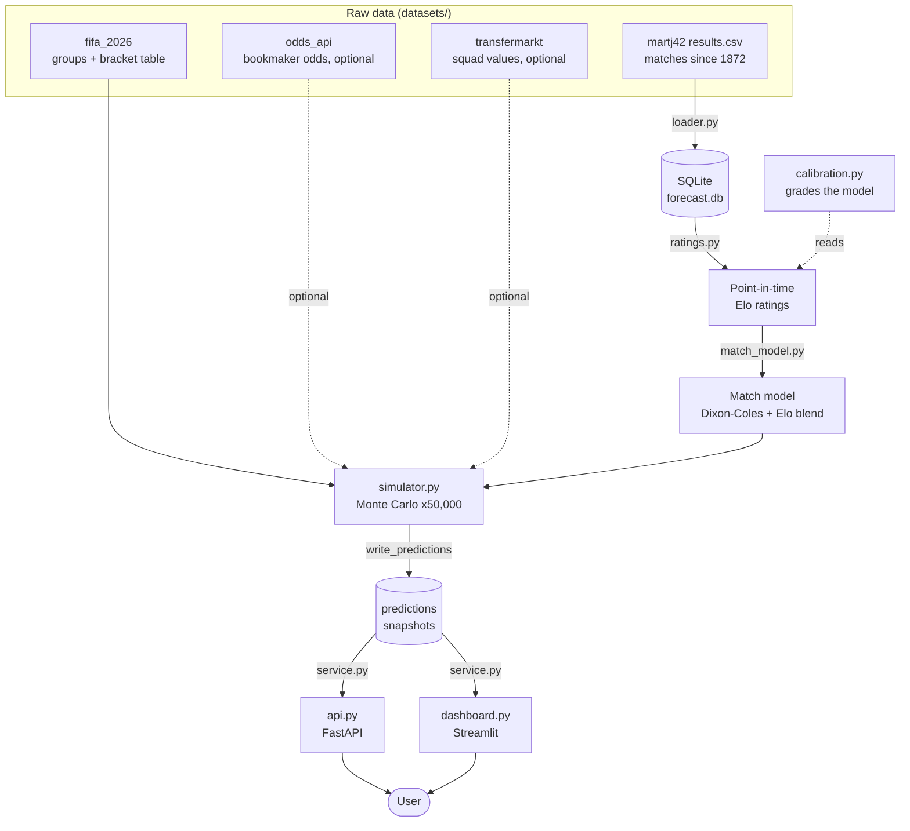
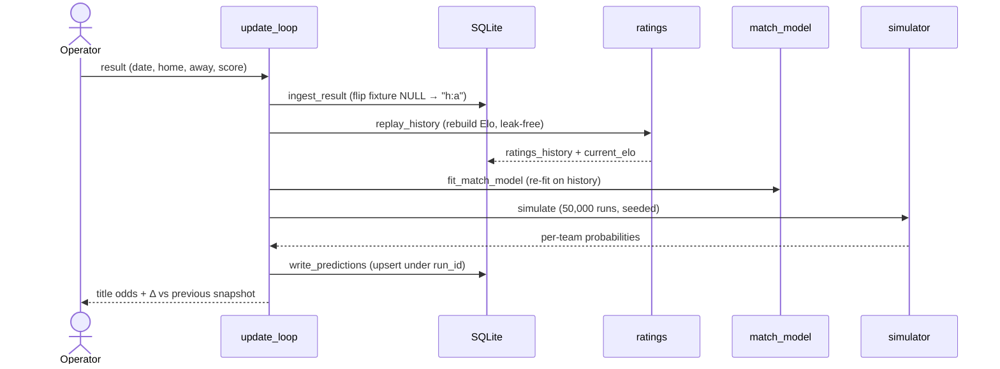
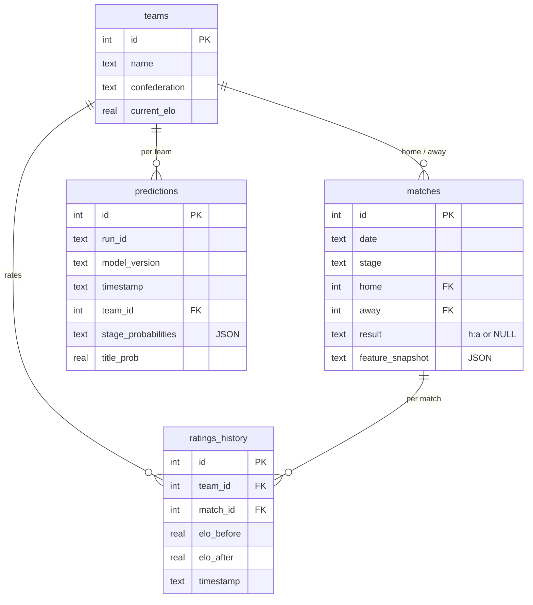

# How It Works — the end-to-end pipeline

This page connects the [concepts](concepts.md) to the [code](code-reference.md) and shows the
whole system as one flow. If [Concepts](concepts.md) answered *"what are the ideas?"*, this
page answers *"how do the pieces fit and in what order do they run?"*.

← Back to the [documentation index](README.md). Design rationale:
[architecture spec §3](architecture-overview.md#3-solution-overview).

## The big picture

The app is a **linear pipeline** with a **loop** at the end for live updates. Raw data flows
in one direction through a chain of modules, lands in a SQLite database, and is served to the
user. When a real match finishes, the loop re-runs the chain and saves a fresh snapshot.

Solid arrows are the core path; dotted arrows are optional inputs that the app runs fine
without.

## Step-by-step: from raw data to title odds

| # | Stage | Module | Input → Output |
|---|-------|--------|----------------|
| 1 | **Load** | [`loader.py`](../src/forecast/loader.py) | `results.csv` → `teams` + `matches` tables |
| 2 | **Rate** | [`ratings.py`](../src/forecast/ratings.py) + [`elo.py`](../src/forecast/elo.py) | played matches → point-in-time Elo in `ratings_history`, latest in `teams.current_elo` |
| 3 | **Fit the match model** | [`match_model.py`](../src/forecast/match_model.py) + [`dixon_coles.py`](../src/forecast/dixon_coles.py) | history + `elo_before` → fitted parameters (β₀, β₁, ρ, draw curve, …) |
| 4 | **Simulate** | [`simulator.py`](../src/forecast/simulator.py) + [`tournament.py`](../src/forecast/tournament.py) | match model + bracket → per-team stage & title probabilities |
| 5 | **Persist** | `simulator.write_predictions` | probabilities → a snapshot in the `predictions` table |
| 6 | **Serve** | [`service.py`](../src/forecast/service.py) → [`api.py`](../src/forecast/api.py) / [`dashboard.py`](../src/forecast/dashboard.py) | snapshot → JSON / web UI |

Steps 1–2 are one-time setup (re-run when data changes); steps 3–5 happen on every forecast;
step 6 reads whatever the latest snapshot is.

Two side activities don't sit on the main path:

- **Calibration** ([`calibration.py`](../src/forecast/calibration.py), `metrics.py`,
  `market.py`) grades the match model on historical data — it's how we know the forecast is
  trustworthy. See [Concepts §8](concepts.md#8-judging-the-forecast-calibration-and-scoring-rules).
- **Data fetching** ([`data_sources.py`](../src/forecast/data_sources.py)) refreshes the raw
  files from the internet. The datasets are already committed, so this is optional.

## The live update loop

During the tournament, each completed match triggers a refresh. This is the "self-evolving"
part of the app, orchestrated by [`update_loop.py`](../src/forecast/update_loop.py). It adds
*no new model logic* — it just re-runs the chain on the new data and saves a snapshot.

Operationally this is one command — see [Operations](operations.md#during-the-tournament-the-update-loop).

## Reproducibility and the `run_id`

Every saved forecast carries a `run_id`. It is **not** random — it's a SHA-256 **fingerprint
of everything that determines the forecast**, computed by `update_loop.state_fingerprint`:

- the model version,
- the simulation count and random seed,
- a digest of **every played match result** (the model's input),
- the blend weights, and
- any optional inputs (live market odds, squad-strength nudges).

Consequences:

- **Same inputs → same `run_id` → identical numbers.** Re-running on an unchanged database
  *overwrites the same snapshot* (the `predictions` table has a uniqueness constraint on
  `(run_id, team_id)`), so you never accumulate duplicate history.
- **Any change → new `run_id` → new snapshot.** A newly completed match, fetched odds, or a
  config change all produce a fresh fingerprint and therefore a new entry in the history.

This is what makes the "pre-tournament vs now" comparison and the auditable snapshot trail
possible. See [architecture §7](architecture-overview.md#7-cross-cutting-concerns).

## The pre-tournament baseline

To answer "how have the odds *moved* since kickoff?", the app stores a fixed reference: a
re-simulation of the whole tournament **as if no group games had been played**, using each
team's reconstructed pre-tournament Elo (`ratings.pretournament_elos`). It's written once
under the reserved `run_id = "pretournament"` by `scripts/build_baseline.py` and is the fixed
"pre" side of the dashboard's toggle.

## The database at the centre

Everything is coordinated through one SQLite file (`forecast.db`) with four tables:

Each table's columns are explained field-by-field in [Data & Datasets](data.md#the-database-schema).

Next: where the data comes from, in [Data & Datasets](data.md).
